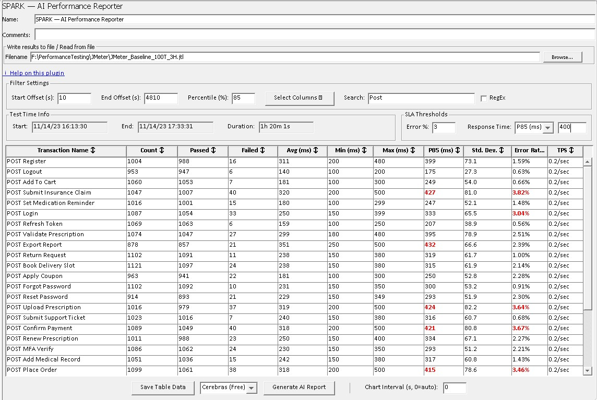

# Configurable Aggregate Report — JMeter Plugin

A file-based Apache JMeter listener plugin for post-test JTL analysis. Load a JTL file and get
a filterable aggregate table, CSV export, and an AI-generated HTML performance report — with zero
runtime overhead.

---

## Contents

- [Features](#features)
- [Requirements](#requirements)
- [Installation](#installation)
- [Quick Start](#quick-start)
- [UI Layout](#ui-layout)
- [Table Columns](#table-columns)
- [Filter Settings](#filter-settings)
- [SLA Thresholds](#sla-thresholds)
- [AI Performance Report](#ai-performance-report)
- [Local LLM Support](#local-llm-support)
- [CLI Mode](#cli-mode)
- [CSV Export](#csv-export)
- [Running Tests](#running-tests)
- [Troubleshooting](#troubleshooting)
- [Contributing](#contributing)
- [License](#license)

---

## Features

| Feature                        | Description                                                                                       |
|--------------------------------|---------------------------------------------------------------------------------------------------|
| 📂 **JTL File Processing**     | Browse and load JTL files — the metrics table populates instantly                                 |
| ⏱️ **Start / End Offset**      | Exclude ramp-up and ramp-down periods by entering a time window in seconds                        |
| 📈 **Configurable Percentile** | Set any percentile value: 50th, 90th, 95th, 99th, or custom                                      |
| 🔍 **Transaction Search**      | Filter the table by transaction name using plain text or regular expressions                      |
| 👁️ **Column Visibility**       | Show or hide any column via a dropdown multi-select control                                       |
| ✅ **Pass / Fail Counts**       | Dedicated columns for transactions passed and transactions failed                                 |
| 🕐 **Test Time Info**          | Start Date/Time, End Date/Time, and total Duration shown automatically                            |
| 🔀 **Sortable Columns**        | Click any column header to sort ascending; click again for descending                             |
| 🚨 **SLA Thresholds**          | Set Error % and Response Time thresholds — breaching cells are highlighted in red                 |
| 💾 **CSV Export**              | Save all visible columns to a CSV file with one click                                             |
| 🤖 **AI Performance Report**   | Generate a styled HTML report with deep-dive analysis, powered by any OpenAI-compatible provider  |
| 📊 **Chart Interval**          | Configure the time-bucket interval for performance charts (default: 30 seconds, or set custom)    |
| 🚫 **No Live Metrics**         | Designed for post-test JTL analysis — no runtime overhead                                        |

---

## Requirements

| Requirement   | Version                    |
|---------------|----------------------------|
| Java          | 17+                        |
| Apache JMeter | 5.6.3+                     |
| Maven         | 3.6+ *(build only)*        |
| AI API key    | *(AI report feature only)* |

---

## Installation

### From Releases (Recommended)

1. Download the latest JAR from the
   [GitHub Releases](https://github.com/sagaraggarwal86/Configurable_Aggregate_Report/releases) page.

2. Copy it to your JMeter `lib/ext/` directory:
   ```
   <JMETER_HOME>/lib/ext/Configurable_Aggregate_Report-<version>.jar
   ```

3. Restart JMeter.

4. *(Optional — CLI mode)* Copy the wrapper scripts to `<JMETER_HOME>/bin/`:
   ```
   <JMETER_HOME>/bin/car-cli-report.bat     (Windows)
   <JMETER_HOME>/bin/car-cli-report.sh      (macOS / Linux)
   ```
   The scripts are in the `src/main/scripts/` directory of the source repository.

5. *(Optional — AI report)* Copy the sample configuration file to `<JMETER_HOME>/bin/`:
   ```
   <JMETER_HOME>/bin/ai-reporter.properties
   ```
   A sample file with all supported options is provided at
   [docs/ai-reporter.properties](docs/ai-reporter.properties).
   Set at least one provider's `api.key` to enable the AI report feature:
   ```properties
   ai.reporter.groq.api.key=
   ai.reporter.openai.api.key=
   ai.reporter.claude.api.key=
   ```

### Build from Source

**Prerequisites:** Java 17+, Maven 3.6+

```bash
git clone https://github.com/sagaraggarwal86/Configurable_Aggregate_Report.git
cd Configurable_Aggregate_Report
mvn clean verify
cp target/Configurable_Aggregate_Report-*.jar $JMETER_HOME/lib/ext/
```

---

## Quick Start

1. In JMeter: **Test Plan → Add → Listener → Configurable Aggregate Report**
2. Click **Browse** and select a JTL file
3. The metrics table populates immediately
4. Adjust filters as needed — the table updates without re-browsing



---

## UI Layout

```
┌─ Name / Comments ──────────────────────────────────────────────────────┐
├─ Write results to file / Read from file ───────────────────────────────┤
│   Filename [________________________________]  [Browse...]              │
├─ Filter Settings ──────────────────────────────────────────────────────┤
│   Start Offset (s)  │  End Offset (s)  │  Percentile (%)               │
│   [Select Columns ▼]   Search: [______________]  [✓ RegEx]             │
├─ Test Time Info ──────────────────────┬─ SLA Thresholds ───────────────┤
│   Start    End    Duration            │  Error %  Response Time  (ms)   │
├─ Results Table (sortable) ─────────────────────────────────────────────┤
│   Transaction Name  │  Count  │  Passed  │  Failed  │  Avg(ms)  │ ...  │
│   HTTP Request      │   19    │    0     │    19    │   448     │ ...  │
│   TOTAL             │   19    │    0     │    19    │   448     │ ...  │
├────────────────────────────────────────────────────────────────────────┤
│   [Save Table Data]  [▼ Provider]  [Generate AI Report]               │
│                                    Chart Interval (s, 0=auto): [0]     │
└────────────────────────────────────────────────────────────────────────┘
```

---

## Table Columns

| Column               | Description                                    |
|----------------------|------------------------------------------------|
| **Transaction Name** | Sampler label — always visible                 |
| **Count**            | Total number of samples                        |
| **Passed**           | Count of successful samples                    |
| **Failed**           | Count of failed samples                        |
| **Avg (ms)**         | Mean response time                             |
| **Min (ms)**         | Fastest recorded response                      |
| **Max (ms)**         | Slowest recorded response                      |
| **Pnn (ms)**         | Configurable percentile column (default: P90)  |
| **Std. Dev.**        | Standard deviation of response times           |
| **Error Rate**       | Percentage of failed samples                   |
| **TPS**              | Transactions per second (throughput)           |

All columns are **sortable** — click the header to sort ascending, click again for descending, click a third time to reset.

Use **Select Columns ▼** to show or hide any column except Transaction Name.

---

## Filter Settings

### Start / End Offset

Offsets let you focus analysis on the steady-state portion of a test by excluding ramp-up and
ramp-down samples. Both values are in seconds, measured from the first sample in the JTL file.

```
Test timeline:  0s────5s────────────25s────30s
All samples:    xxxxxx|=============|xxxxxx
                ^skip  ^included     ^skip

Start Offset = 5   →  skip samples before 5s from test start
End Offset   = 25  →  skip samples after 25s from test start
```

| Start Offset | End Offset | Behaviour                                       |
|--------------|------------|-------------------------------------------------|
| *(empty)*    | *(empty)*  | All samples included                            |
| `5`          | *(empty)*  | Skip first 5 seconds; include the rest          |
| *(empty)*    | `25`       | Include up to 25 seconds; skip everything after |
| `5`          | `25`       | Include only the 5s – 25s window                |

> **Tip:** Changing offset values re-parses the JTL file automatically after a brief pause — no need to re-browse.

### Transaction Search

Filter the results table by typing in the **Search** field. Only matching transactions are shown.

| Mode                     | Behaviour                        | Example                          |
|--------------------------|----------------------------------|----------------------------------|
| **Plain text** (default) | Case-insensitive substring match | `login` matches `Login Flow`     |
| **RegEx** (checkbox on)  | Java regex pattern match         | `Login\|Checkout` matches either |

> Invalid regex patterns are silently ignored — the table shows no matches rather than throwing an error.

### Test Time Info

Displayed automatically after loading a JTL file.

| Field               | Description                                                |
|---------------------|------------------------------------------------------------|
| **Start Date/Time** | Timestamp of the first included sample (local timezone)    |
| **End Date/Time**   | Timestamp when the last included sample completed          |
| **Duration**        | Wall-clock time from first sample start to last sample end |

> **Note:** Duration may be slightly longer than `End Offset − Start Offset` because it includes
> the response time of the last sample within the window.

### Chart Interval

The **Chart Interval (s, 0=auto)** field controls the time-bucket width used for performance
charts in the AI report.

| Value | Behaviour                                           |
|-------|-----------------------------------------------------|
| `0`   | Auto — uses the default 30-second bucket interval   |
| `10`  | Each chart data point represents a 10-second window |
| `60`  | Each chart data point represents a 1-minute window  |

Valid range: 0–3600 seconds.

### Sub-Result Filtering

The plugin automatically excludes sub-results from aggregation — only parent samples appear in
the table. This matches the behaviour of JMeter's built-in Aggregate Report.

Sub-results are detected in two ways:

- **Transaction Controller children** — child HTTP samples written immediately after a
  Transaction Controller row with matching elapsed time
- **Numbered suffixes** — labels such as `HTTP Request-1`, `HTTP Request-2` where the parent
  label `HTTP Request` also exists in the JTL file

---

## SLA Thresholds

Set live SLA thresholds in the **SLA Thresholds** panel. Breaching cells are highlighted in
**red bold** — no re-parse required.

| Field             | Description                                                                                   |
|-------------------|-----------------------------------------------------------------------------------------------|
| **Error %**       | Highlight Error Rate cells exceeding this value (1–99)                                        |
| **Response Time** | Choose **Avg (ms)** or **Pnn (ms)** from the dropdown, then enter a threshold in milliseconds |

- The TOTAL row is never highlighted regardless of values.
- Leave a field blank to disable that threshold.

---

## CSV Export

1. Click **Save Table Data** at the bottom of the panel.
2. Choose a save location — the default filename is `aggregate_report.csv`.
3. Only **currently visible columns** are exported (header row is always included).

---

## AI Performance Report

Click **Generate AI Report** to analyse the loaded JTL data with any supported AI provider.
A save dialog lets you choose where to save the self-contained HTML report.

**Supported providers:** Groq (free, **Recommended**), Gemini (free), Mistral (free), DeepSeek (free),
OpenAI (paid), Claude (paid), Ollama (local / free) — or any OpenAI-compatible endpoint.

### Report Contents

| Section                   | Description                                                    |
|---------------------------|----------------------------------------------------------------|
| Executive Summary         | Scenario overview, PASS/FAIL verdict, and top recommendation   |
| Bottleneck Analysis       | Throughput, latency, and error pattern with classification     |
| Error Analysis            | Failure mode characterisation and SLA threshold verdict        |
| Advanced Web Diagnostics  | Response time breakdown by network, server, and transfer phase |
| Root Cause Hypotheses     | Ranked list of probable causes with supporting metric evidence |
| Recommendations           | Prioritised action table mapped to root cause findings         |
| Verdict                   | Single PASS or FAIL outcome anchored to the decisive metric    |
| Transaction Metrics Table | Full per-transaction breakdown                                 |
| Performance Charts        | Response time, error rate, throughput, and bandwidth over time |

### Truncation Detection

If the AI provider returns a response that was cut short by the token limit, a visible warning
blockquote is automatically appended to the generated HTML report:

> **⚠ Report truncated** — The Gemini (Free) response was cut off because it reached the
> `max_tokens` limit. One or more sections (e.g. Recommendations, Verdict) may be missing.
> Increase `max_tokens` in `ai-reporter.properties` for the `gemini` provider and regenerate.

The plugin detects truncation via two signals — the standard `finish_reason: "length"` field,
and a fallback check of `usage.completion_tokens >= max_tokens` for providers (such as Gemini)
that return `finish_reason: "stop"` even when the token limit was hit.

The default `max_tokens` for all providers is **8192**. If you still see truncated reports,
increase the value for the affected provider in `ai-reporter.properties`:

```properties
ai.reporter.gemini.max.tokens=16000
```

### API Key Setup

Copy [docs/ai-reporter.properties](docs/ai-reporter.properties) to `<JMETER_HOME>/bin/`
and set at least one provider's `api.key`:

```properties
ai.reporter.groq.api.key=gsk_your-key-here
ai.reporter.openai.api.key=sk-your-key-here
ai.reporter.gemini.api.key=AIza-your-key-here
ai.reporter.claude.api.key=sk-ant-your-key-here
ai.reporter.mistral.api.key=your-key-here
ai.reporter.deepseek.api.key=your-key-here
```

Select the provider from the dropdown next to the **Generate AI Report** button.

---

## Local LLM Support

The plugin supports **Ollama** — a local model runner — as a fully offline, free alternative to
cloud AI providers. No API key, no internet connection required after model download.

### Setup

1. **Install Ollama** from [https://ollama.com](https://ollama.com) (Windows / macOS / Linux).
   Ollama starts automatically as a local service on `http://localhost:11434`.

2. **Pull a model:**

   ```bash
   ollama pull llama3.2       # ~2 GB — fast, good quality
   ollama pull mistral        # ~4 GB — strong reasoning
   ollama pull qwen2.5:7b     # ~5 GB — strong analytical reasoning (recommended)
   ```

3. **Add an Ollama block to `ai-reporter.properties`:**

   ```properties
   ai.reporter.ollama.api.key=ollama
   ai.reporter.ollama.model=llama3.2
   ai.reporter.ollama.base.url=http://localhost:11434/v1
   ai.reporter.ollama.timeout.seconds=120
   ai.reporter.ollama.max.tokens=8192
   ai.reporter.ollama.temperature=0.3
   ```

   > **Note:** `api.key` must be non-blank — use any dummy value such as `ollama`.

4. Select **ollama** from the provider dropdown and click **Generate AI Report**.

### Recommendations

| Concern                | Guidance                                                                          |
|------------------------|-----------------------------------------------------------------------------------|
| **Model quality**      | `qwen2.5:7b` or `mistral` produce the best performance analysis output            |
| **Speed (CPU only)**   | Set `timeout.seconds=180` or higher; generation can take 1–3 minutes on CPU       |
| **Speed (GPU)**        | Generation is near-instant; default `timeout.seconds=120` is sufficient           |
| **Memory**             | Ensure at least 8 GB RAM free before pulling a 7B model                           |
| **CLI usage**          | `--provider ollama` works identically to any other provider                       |

---

## CLI Mode

Generate an AI performance report from the command line — no JMeter GUI required.

### Setup

Copy the wrapper scripts to your JMeter `bin/` directory:

```
<JMETER_HOME>/bin/car-cli-report.bat    ← Windows
<JMETER_HOME>/bin/car-cli-report.sh     ← macOS / Linux
<JMETER_HOME>/lib/ext/Configurable_Aggregate_Report-<version>.jar  ← already installed
```

The scripts auto-detect the JMeter installation from their own location — no environment
variables needed.

### Quick Start

**Windows:**
```cmd
car-cli-report.bat -i results.jtl --provider groq --config ai-reporter.properties
```

**macOS / Linux:**
```bash
./car-cli-report.sh -i results.jtl --provider groq --config ai-reporter.properties
```

### All Options

```
Required:
  -i, --input FILE            JTL file path
  --provider STRING           provider name, case-insensitive
                              (groq, openai, claude, gemini, mistral, deepseek,
                               ollama, or any custom key in ai-reporter.properties)
  --config FILE               path to ai-reporter.properties

Output:
  -o, --output FILE           HTML report output path (default: ./report.html)

Filter Options:
  --start-offset INT          seconds to trim from start
  --end-offset INT            seconds to trim from end
  --percentile INT            percentile 1-99 (default: 90)
  --chart-interval INT        seconds per chart bucket, 0=auto (default: 0)
  --search STRING             label filter text
  --regex                     treat --search as regex

Report Metadata:
  --scenario-name STRING      scenario name for report header
  --description STRING        scenario description
  --virtual-users INT         virtual user count for report header

SLA Thresholds:
  --error-sla INT             error rate threshold % (1-99)
  --rt-sla LONG               response time threshold in ms
  --rt-metric avg|percentile  which RT column for --rt-sla (default: percentile)

Help:
  -h, --help                  print this message and exit
```

### Exit Codes

| Code | Meaning                                                               |
|------|-----------------------------------------------------------------------|
| `0`  | AI verdict **PASS** — pipeline continues                              |
| `1`  | AI verdict **FAIL** — pipeline gate fails                             |
| `2`  | AI verdict **UNDECISIVE** — pipeline continues                        |
| `3`  | Invalid arguments                                                     |
| `4`  | JTL parse error                                                       |
| `5`  | AI provider error (key, ping, or API failure)                         |
| `6`  | Report write error                                                    |
| `7`  | Unexpected error — full stack trace printed to `stderr`               |

### Example — CI/CD Pipeline

```bash
./car-cli-report.sh \
  -i results.jtl -o report.html \
  --provider openai --config /etc/jmeter/ai-reporter.properties \
  --start-offset 10 --end-offset 300 --percentile 95 \
  --scenario-name "Nightly Load Test" --virtual-users 200 \
  --error-sla 5 --rt-sla 2000 --rt-metric percentile

EXIT_CODE=$?
if [ $EXIT_CODE -eq 1 ]; then
  echo "Performance gate FAILED — AI verdict: FAIL"
  exit 1
elif [ $EXIT_CODE -eq 2 ]; then
  echo "Performance gate UNDECISIVE — review report manually"
fi
```

On success, two lines are printed to stdout:

```
/absolute/path/to/report.html
VERDICT:PASS
```

The verdict line is always one of `VERDICT:PASS`, `VERDICT:FAIL`, or `VERDICT:UNDECISIVE`.

> **CI/CD Pipeline Gate:** Use the exit code as a quality gate — exit code `1` (VERDICT:FAIL) fails
> the build; exit codes `0` (PASS) and `2` (UNDECISIVE) continue. The report path on the first
> stdout line can be captured and published as a build artifact.

---

## Running Tests

```bash
# Build and run all tests
mvn clean verify

# Unit tests only
mvn test

# Standalone UI preview — no JMeter installation needed
mvn test-compile exec:java
```

---

## Troubleshooting

**The AI report is missing sections — Recommendations or Verdict are absent, or a truncation warning appears.**
The AI provider reached the `max_tokens` limit before finishing the report. If the response was
cut short, a blockquote warning is shown at the end of the report with the provider name and the
config key to increase. Raise the limit in `ai-reporter.properties`:
```properties
ai.reporter.gemini.max.tokens=16000
```
The default for all providers is `8192`. Gemini models tend to be more verbose — `12000–16000`
is recommended if truncation occurs. After saving the file, regenerate the report (no restart needed).

**The plugin does not appear in JMeter's Add → Listener menu.**
Verify the JAR is in `<JMETER_HOME>/lib/ext/` and not in `lib/` or any subdirectory.
Restart JMeter after copying the file.

**The Generate AI Report button is greyed out.**
The plugin found no configured provider. Verify that `ai-reporter.properties` exists in
`<JMETER_HOME>/bin/` and that at least one `api.key` value is set.

**"No Data" dialog appears when clicking Generate AI Report.**
No JTL file has been loaded yet. Click **Browse**, select a JTL file, and wait for the table
to populate before generating the report.

**The HTML report shows "Insufficient data for time-series charts" instead of charts.**
The test run was too short, or `--start-offset` / `--end-offset` filters excluded most samples,
leaving fewer than two 30-second time buckets. Try reducing `--start-offset`, or remove the
offset flags entirely and re-run. For smoke tests under 60 seconds, charts will not render — all
other report sections (AI analysis, transaction table, verdict) are unaffected.

**Charts in the HTML report are blank (no data, no message).**
The report requires internet access to load the Chart.js library from a CDN. Open the file in
Chrome or Firefox on a machine with internet access.

**The table shows no rows after loading a JTL file.**
Check that Start Offset and End Offset are not together excluding all samples. If the fields
are blank and the table is still empty, verify the JTL file is a valid CSV and was not
truncated during the test run.

**The AI report times out.**
Increase `timeout.seconds` for the provider in `ai-reporter.properties`. The default is
60 seconds. For large JTL files, 120–180 seconds is recommended. For Ollama on CPU-only
machines, 180–300 seconds may be required.

**API key rejected — "HTTP 401" error.**
The `api.key` value in `ai-reporter.properties` is incorrect or has been revoked. Verify the
key on your provider's dashboard and update the properties file. The plugin re-reads the file
on every **Generate AI Report** click — no restart needed.

**Rate limit exceeded — "HTTP 429" error.**
The provider's free tier limit has been reached. Wait a moment and try again, or switch to a
different provider in the dropdown. Groq's free tier resets every minute; Gemini's resets daily.

**Ollama: "Could not connect" error.**
Ollama is not running. Start it with `ollama serve` (or it starts automatically on most
installations when you run `ollama pull`). Verify it is reachable at `http://localhost:11434`.
Also confirm the model you specified in `ai-reporter.properties` has been pulled:
```bash
ollama list
```

---

## Contributing

Bug reports and pull requests are welcome via
[GitHub Issues](https://github.com/sagaraggarwal86/Configurable_Aggregate_Report/issues).

Before submitting a pull request:

- Run `mvn clean verify` and confirm all tests pass
- Test manually with JMeter 5.6.3 on your platform
- Keep each pull request focused on a single change

For questions or feature requests, open a GitHub Issue with as much context as possible —
JMeter version, OS, and steps to reproduce.

---

## License

Apache License 2.0 — see [LICENSE](LICENSE) for details.

