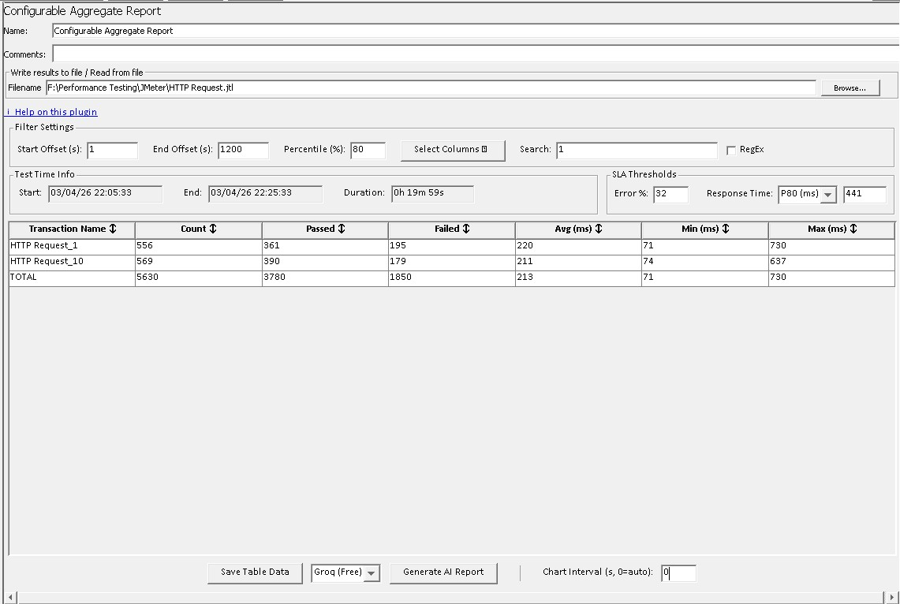

# 📊 Configurable Aggregate Report (AI-Powered) — JMeter Plugin

> A file-based Apache JMeter listener plugin for post-test JTL analysis. Load a results file and get
> a filterable aggregate table, CSV export, and an AI-generated HTML performance report — with zero runtime overhead.

---

## ✨ Features at a Glance

| Feature                        | Description                                                                                       |
|--------------------------------|---------------------------------------------------------------------------------------------------|
| 📂 **JTL File Processing**     | Browse and load JTL files — the metrics table populates instantly                                 |
| ⏱️ **Start / End Offset**      | Exclude ramp-up and ramp-down periods by entering a time window in seconds                        |
| 📈 **Configurable Percentile** | Set any percentile value: 50th, 90th, 95th, 99th, or custom                                       |
| 👁️ **Column Visibility**      | Show or hide any column via a dropdown multi-select control                                       |
| ✅ **Pass / Fail Counts**       | Dedicated columns for transactions passed and transactions failed                                 |
| 🕐 **Test Time Info**          | Start Date/Time, End Date/Time, and total Duration shown automatically                            |
| 🔀 **Sortable Columns**        | Click any column header to sort ascending; click again for descending                             |
| 💾 **CSV Export**              | Save all visible columns to a CSV file with one click                                             |
| 🤖 **AI Performance Report**   | Generate a styled HTML report with deep-dive bottleneck, error, and web diagnostics analysis, powered by Groq AI |
| 🚫 **No Live Metrics**         | Designed for post-test JTL analysis — no runtime overhead                                         |

---

## 📦 Installation

### From Releases (Recommended)

1. Download the latest JAR from
   the [GitHub Releases](https://github.com/sagaraggarwal86/Configurable_Aggregate_Report/releases) page or click here
   to download
   instantly [latest JAR](https://github.com/sagaraggarwal86/Configurable_Aggregate_Report/releases/download/v2.5.0/Configurable_Aggregate_Report-2.7.0.jar)

3. Copy it to your JMeter `lib/ext/` directory:
   ```
   <JMETER_HOME>/lib/ext/Configurable_Aggregate_Report-2.7.0.jar
   ```
4. Restart JMeter

### Build from Source

**Prerequisites:** Java 17+, Maven 3.6+

```bash
git clone https://github.com/sagaraggarwal86/Configurable_Aggregate_Report.git
cd Configurable_Aggregate_Report
mvn clean package
cp target/Configurable_Aggregate_Report-2.7.0.jar $JMETER_HOME/lib/ext/
```

> **Publishing to Maven Central** requires the `release` profile (sources JAR, Javadoc JAR, GPG signing):
> ```bash
> mvn deploy -P release
> ```

---

## 🚀 Quick Start

1. In JMeter: **Test Plan → Add → Listener → Configurable Aggregate Report**
2. Click **Browse** → select a `.jtl` results file
3. The metrics table populates immediately
4. Adjust filters as needed — the table updates instantly without re-browsing

---

## 🖥️ UI Layout

```
┌─ Name / Comments ──────────────────────────────────────────────────────┐
├─ Write results to file / Read from file ───────────────────────────────┤
│   Filename [________________________________]  [Browse...]              │
├─ Filter Settings ──────────────────────────────────────────────────────┤
│   Start Offset (s)  │  End Offset (s)  │  Percentile (%)               │
│   [Select Columns ▼]   Search: [______________]  [✓ RegEx]             │
├─ Test Time Info ───────────────────────────────────────────────────────┤
│   Start Date/Time          End Date/Time           Duration             │
│   [03/04/26 15:52:04]     [03/04/26 15:52:15]     [0h 0m 11s]          │
├─ Results Table (sortable) ─────────────────────────────────────────────┤
│   Transaction Name  │  Count  │  Passed  │  Failed  │  Avg(ms)  │ ...  │
│   HTTP Request      │   19    │    0     │    19    │   448     │ ...  │
│   TOTAL             │   19    │    0     │    19    │   448     │ ...  │
├────────────────────────────────────────────────────────────────────────┤
│            [Save Table Data]      [Generate AI Report]                 │
└────────────────────────────────────────────────────────────────────────┘
```


---

## 📋 Table Columns

| Column                     | Description                                    |
|----------------------------|------------------------------------------------|
| **Transaction Name**       | Sampler label — always visible                 |
| **Transaction Count**      | Total number of samples                        |
| **Transaction Passed**     | Count of successful samples                    |
| **Transaction Failed**     | Count of failed samples                        |
| **Avg Response Time (ms)** | Mean response time                             |
| **Min Response Time (ms)** | Fastest recorded response                      |
| **Max Response Time (ms)** | Slowest recorded response                      |
| **Xth Percentile (ms)**    | Configurable percentile column (default: 90th) |
| **Std. Dev.**              | Standard deviation of response times           |
| **Error Rate**             | Percentage of failed samples                   |
| **TPS**                    | Transactions per second (throughput)           |

All columns are **sortable** — click the header to sort ascending, click again for descending.

Use **Select Columns ▼** to show or hide any column except Transaction Name.

---

## ⏱️ Start / End Offset Filtering

Offsets let you focus analysis on the steady-state portion of a test by excluding ramp-up and ramp-down samples. Both
values are in seconds, measured from the first sample in the file.

```
Test timeline:  0s────5s────────────25s────30s
All samples:    xxxxxx|=============|xxxxxx
                ^skip  ^included     ^skip

Start Offset = 5   →  skip samples before 5s from test start
End Offset   = 25  →  skip samples after 25s from test start
```

| Start Offset | End Offset | Behaviour                                       |
|--------------|------------|-------------------------------------------------|
| *(empty)*    | *(empty)*  | All samples included                            |
| `5`          | *(empty)*  | Skip first 5 seconds; include the rest          |
| *(empty)*    | `25`       | Include up to 25 seconds; skip everything after |
| `5`          | `25`       | Include only the 5s – 25s window                |

> **Tip:** Changing offset values re-parses the JTL file instantly — no need to re-browse.

---

## 🕐 Test Time Info

Displayed automatically below the filter settings after loading a JTL file.

| Field               | Description                                                |
|---------------------|------------------------------------------------------------|
| **Start Date/Time** | Timestamp of the first included sample (local timezone)    |
| **End Date/Time**   | Timestamp when the last included sample completed          |
| **Duration**        | Wall-clock time from first sample start to last sample end |

> **Note:** Duration may be slightly longer than `End Offset − Start Offset` because it includes
> the response time of the last sample within the window.

---

## 💾 Saving Table Data

1. Click **Save Table Data** at the bottom of the panel
2. Choose a save location — the default filename is `aggregate_report.csv`
3. Only **currently visible columns** are exported
4. Toggle **Save Table Header** to include or exclude the column header row

---

## 🔧 Sub-Result Filtering

JMeter writes embedded sub-requests as separate rows in the JTL file (e.g. `HTTP Request-0`, `HTTP Request-1`). The
plugin automatically detects and excludes these — only parent samples are aggregated, matching the behaviour of JMeter's
built-in Aggregate Report.

---

## 🤖 AI Performance Report

Click **Generate AI Report** to send the loaded JTL data to Groq AI (Llama 3.3-70B). The plugin produces a
self-contained, styled HTML file saved next to your JTL file.

### What the Report Contains

| Section                       | Description                                                                                                        |
|-------------------------------|--------------------------------------------------------------------------------------------------------------------|
| **Executive Summary**         | End-to-end narrative paragraph: scenario context, system behaviour under load, dominant constraint, PASS/FAIL verdict, and highest-priority action |
| **Bottleneck Analysis**       | Technical interpretation of throughput, latency, and error pattern cross-correlated into a single bottleneck classification (throughput-bound, latency-bound, or error-bound), followed by a supporting metrics table |
| **Error Analysis**            | Error pattern characterisation (load-correlated surge vs. systemic defect), threshold breach verdict, and operational impact assessment, followed by a pass/fail accounting table |
| **Advanced Web Diagnostics**  | Response time decomposed into network establishment, server processing, and transfer phases with ms and % values; dominant phase identified with remediation focus, followed by a phase breakdown table |
| **Root Cause Hypotheses**     | Ranked list of system-level hypotheses, each citing a specific metric value and naming the implicated component layer |
| **Recommendations**           | Prioritised action table (3–7 items) derived directly from the analysis findings                                   |
| **Verdict**                   | Single PASS or FAIL sentence anchored to the decisive aggregate metric and threshold value                         |
| **Transaction Metrics Table** | Full per-transaction breakdown matching the plugin table                                                            |
| **Performance Charts**        | Four time-series charts: Average Response Time, Error Rate, Throughput, and Bandwidth (30-second intervals)        |

### API Key Setup

Set the Groq API key in your environment before starting JMeter:

```bash
# macOS / Linux
export GROQ_API_KEY=your-key-here

# Windows (PowerShell)
$env:GROQ_API_KEY = "your-key-here"
```

---

## 📋 Requirements

| Requirement   | Version                    |
|---------------|----------------------------|
| Java          | 17+                        |
| Apache JMeter | 5.6.3+                     |
| Maven         | 3.6+ *(build only)*        |
| Groq API key  | *(AI report feature only)* |

---

## 🧪 Running Tests

```bash
# Unit tests
mvn test

# Standalone UI preview — no JMeter installation needed
mvn exec:java -Dexec.mainClass="com.personal.jmeter.UIPreview"
```

---

## 🤝 Contributing

Pull requests and issues are welcome!
Please test with JMeter 5.6+ on Windows, macOS, and Linux.

---

## 📄 License

Apache License 2.0 — see [LICENSE](LICENSE) for details.

## 👋 Visitors

